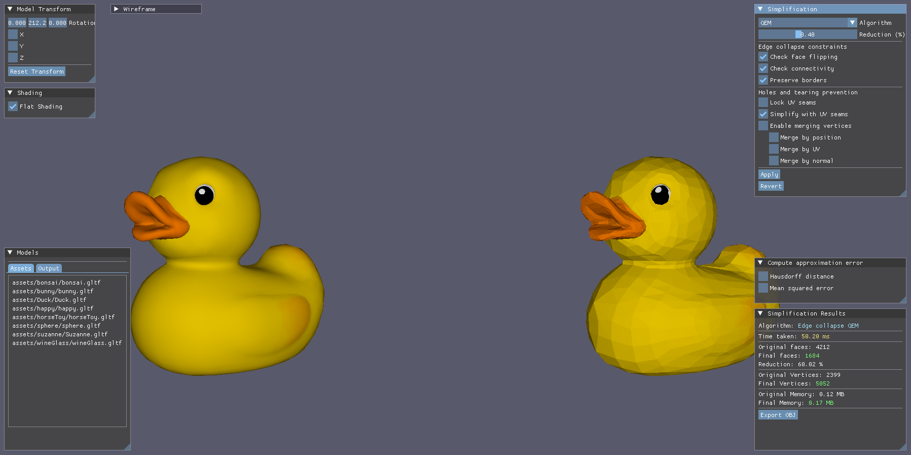
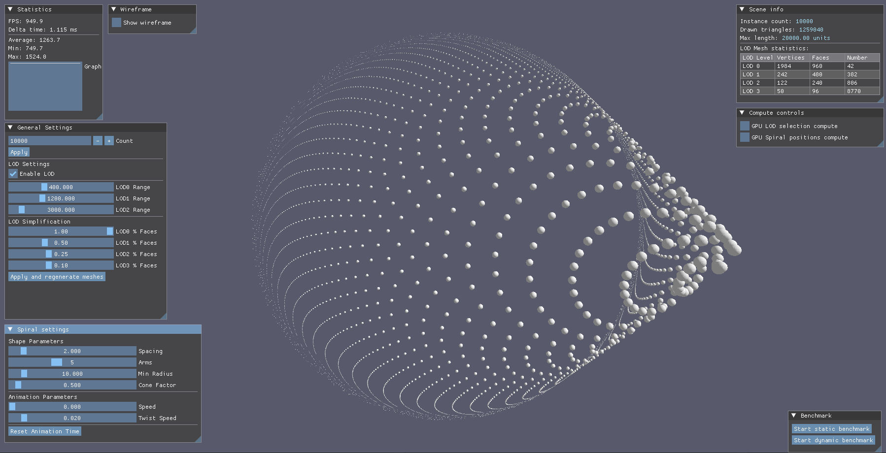

# Polygonal mesh simplification and rendering optimization using Level of Detail techniques

## Beforeword
This repository contains the implementation of a bachelor's thesis focused on polygonal mesh
simplification and rendering optimization using Level of Detail (LOD) techniques. The project
is developed in ```C++``` using the ```Vulkan API``` for rendering and includes various simplification
algorithms, an application for polygonal mesh simplification and an application for benchmarking
the effects of Level of Detail techniques and GPU-driven rendering.

## Simplificator
The simplification application (```Simplificator```) can be freely used for mesh simplification.



### Features
- Simple ```glTF``` model loading with a **single** base texture.
- Per-mesh simplification using various algorithms and metrics:
	- ```QEM```
	- ```Vertex Clustering```
	- ```Floating Cell Clustering```
	- ```Vertex Decimation```
	- ```Naive approaches``` (for comparison purposes)
- Wireframe mode and first person camera for better visualization of the results.
- Hausdorff distance and MSE (Mean Squared Error) metrics for geometric quality evaluation.
- Interactive GUI for adjusting simplification parameters and visualizing the results.
- Flat shading or smooth shading of the simplified model.
- Export of the simplified model to a simple ```.obj``` file and loading it back in for further simplifications.

### Limitations and known issues
- ```Simplificator``` works best with manifold meshes for geometric simplification.
- For textured models, only ```QEM``` algorithm is currently supported via ```Lock UV Seams```
and ```Simplify with UV Seams``` options. If there are no UV seams in the textured model, the simplification
may not preserve the texture coordinates properly, leading to visual artifacts.
In such cases, it is recommended to use the ```QEM``` algorithm without UV seam approaches for better results.
- Hausdorff distance and MSE metrics are not optimized and may take longer for complex models.
- Damaged models (ie. models with scattered meshes) are not supported by most of the simplification algoritms
and may create holes in the mesh during simplification proccess.
- In rare cases, some algorithms may produce non-optimal results with visual artifacts.


## Spiral scene
The benchmarking application (```SpiralApp```) is designed to demonstrate the performance benefits
of LOD techniques and GPU-driven rendering.



### Features
- Rendering of a large number of instances with different LOD levels.
- Customizable spiral parameters.
- Scene metadata display.
- Customizable LOD configuration for instances of the model on the spiral.
- GPU-driven rendering using ```compute shader``` for instance spiral positions and LOD selection.
- Wireframe mode with instances colored by their LOD level for better visualization of the LOD distribution.
- Auto-calibrated benchmark setup for performance evaluation of different hardware configurations.
- Semi-automated graph plotting of the benchmark results.

### Limitations and known issues
- As of now, the AMD graphics cards provide higher instance performance in the benchmarks than NVIDIA ones. Tested on several different hardware configurations.
- Instance positioning can become unstable when changing the spiral parameters and not resetting the animation time.
- The displayed *Drawn triangles* statistic while choosing the GPU modes is a quite precise estimation, but estimation nevertheless, and can slightly differ from the actual number of triangles drawn by the GPU.


# Requirements

- Windows 10 or later.
- MSVC compiler (Visual Studio 2022 or later) with C++17 support.
- Vulkan-compatible GPU and drivers.
- Vulkan SDK [found here](https://vulkan.lunarg.com/sdk/home). Make sure to restart Visual Studio after the installation.
- ```CMake``` (version 3.10.2 or later) for building the project
- *(optional)* Python and ```matplotlib```, ```pandas``` and ```numpy``` libraries for performance plotting, if desired.

# Building the project

1. Clone the repository.
2. Open the cloned folder in Visual Studio.
3. Wait for Visual Studio to automatically generate the CMake cache.
4. Build the project. This will compile both the `Simplificator` and `SpiralApp` applications.
5. Once the build is complete, you can run the applications directly from Visual Studio or from the output directory.
6. You can add more 3D models to the output `/assets` directory, or add them to the source `/assets` directory and re-configure CMake to copy them over.

If you don't want to bother with compiling, you can simply download the pre-compiled binaries from the **Releases** page.

# Used libraries
- [Vulkan SDK](https://vulkan.lunarg.com/sdk/home)
- [Vulkan Memory Allocator](https://github.com/GPUOpen-LibrariesAndSDKs/VulkanMemoryAllocator)
- [GLFW](https://github.com/glfw/glfw)
- [Dear ImGui](https://github.com/ocornut/imgui)
- [TinyGLTF](https://github.com/syoyo/tinygltf)
- [GLM](https://github.com/g-truc/glm)

# Assets table
Several models were used for testing the simplification algorithms and benchmarking the rendering performance. Below is a table listing the assets and their sources.

| Asset | Source | Author | Licence |Note |
| ------------- | ------------- | --------- | ---- |
| Duck  | [Khronos repository](https://github.com/KhronosGroup/glTF-Sample-Models/tree/main/2.0/Duck/glTF)|KhronosGroup| ```SCEA 1.0```|
| Suzanne | [Kronos repository](https://github.com/KhronosGroup/glTF-Sample-Models/tree/main/2.0/Suzanne) |Norbert Nopper|```none (donated to the repository by Norbert Nopper)```|
| Stanford bunny | [SketchFab](https://sketchfab.com/3d-models/stanford-bunny-43f266d6cd6e4c6888b9943557528c0f)|darwinsenior|```CC BY 4.0```|
| Happy Buddha | [SketchFab](https://sketchfab.com/3d-models/happy-buddha-stanford-5f2a444ff26c4a3bb194f6d79502ee54) |3D graphics 101|```CC BY-NC 4.0```|
| Skull | [SketchFab](https://sketchfab.com/3d-models/skull-downloadable-1a9db900738d44298b0bc59f68123393) |martinjario|```CC BY 4.0```|
| Male Body | [SketchFab](https://sketchfab.com/3d-models/male-body-base-mesh-highpoly-9311f4f8fa1a4fe4bb0027ff7e8fd795) |Mandrake|```CC BY 4.0```| Fixed in Blender|
| Boot | [SketchFab](https://sketchfab.com/3d-models/caterpillar-work-boot-d551ce74dcd24528a05cbb0f4b7434d7) |inciprocal| ```CC BY 4.0```| Stripped off of the 4k PBR textures |
| sphere | Created in Blender |```none```|
